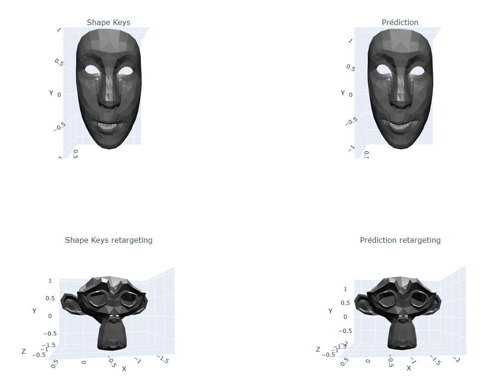

# AlphPipeline

AlphSistant is an AI-oriented project that aims to create automatic 3D animations. The goal is to realize deep learning models allowing to animate a face from a recording. 
In this directory, you will find the different modules used to develop these deep learning models.

